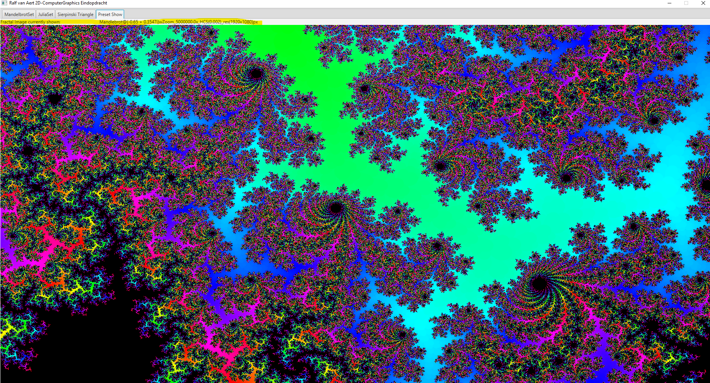

# 2D-Computergraphics Eindopdracht
>Ralf van Aert

- Studentennummer: 2163995
- Studenten-mail: rpj.vanaert@student.avans.nl

### **Inleiding**
Voor mijn eindopdracht van 2D-Computergraphics Eindopdracht heb ik gekozen voor fractals. Dit intereseerde me het meest van alle. Ik had altijd al zelf een Mandelbrot Set zoom willen maken. Toen ik daarna toe werkte kwam ik achter wat een Julia Set was en deze was erzo bij genomen, de rest is zoals ze zeggen geschiedenis...

Deze applicatie kan fractals renderen en opslaan als een HD afbeelding. Er zijn 4 verschillende tabs;
- MandelbrotSetTab
- JuliaSetTab
- OtherFractalsTab
    - SierpinskiTriangle
    - Tree Fractal
- Preset Show Tab

---

### **Mandelbrot Set Tab**
De Mandelbrot Set Tab kan de Mandelbrot Set Zooms renderen met een resolutie van 1920 bij 1080 pixels. Er is in te stellen wat het focus punt is, het punt in het midden van de render. Er kan gezoomt worden op de afbeelding, maar er wordt alleen maar gerendered naar de ingestelde variabelen in de TextFields.

Als je dus meer op een punt in wilt zoomen, met render, dan moet je de stepsize aanpassen. Stepsize is het verschil tussen 2 naast liggende pixels, het inverse van een zoom dus.

Naast al dat is er ook in te stellen wat de maximum hoeveelheid iteraties is per pixel en de Hue Cycle Speed. Hue Cycle Speed is de snelheid waarmee de kleur veranderd per iteratie.

Ten slot is er de mogelijkheid om de afbeelding op te slaan, de afbeelding wordt opgeslagen in het project folder genaamd "SaveFolder".

---

### **Julia Set Tab**
De Julia Set Tab is een tab die Julia sets genereerd. Elke Julia Set heeft een eigen coördinaat vanwaar het uitgerekend is. Dit punt noemen we C. Punt C is complex en is in te stellen via C P. Real en C P. Imag TextFields. Naast dat werkt de Julia Set Tab precies hetzelfde als de Mandelbrot Set Tab.

De Julia Set Tab heeft dus ook een focus punt, stepsize, iteraties en Hue Cycle Speed. Deze tab kan dus ook een afbeelding opslaan, ook dit gebeurt in dezelfde folder.

---

### **Other Fractals Tab**
In de Other Fractals Tab kunnen 2 fractals weergegeven worden; Sierpinski Triangle en Tree Fractal. Sierpinski Triangle kan tot een order van 9 en de Tree Fractal tot een order van 15. Dit gebeurt om de applicatie zo soepel mogelijk te laten lopen.

Ook in deze tab kan je inzoomen en draggen. De camera transformatie wordt inbegrepen bij de Sierpinski Triangle als je save image doet, maar niet bij TreeFractal.

---

### **Preset Show Tab**

In de Preset Show Tab worden alle vooraf opgeslagen fractals weergegeven. Dit zijn voorbeelden van Mandelbrot Set Zooms, Julia Sets en wat Other Fractals.

Links bovenin, gemarkeerd in de afbeelding hieronder, is de naam van de afbeelding te zien, die alle nodige informatie geeft over de fractal en de afbeelding zelf.

